# Полное описание проекта «Голосовые команды»

Документ объединяет **итог реализованной работы**, **структуру системы** и **диаграммы** (Mermaid — отображаются на GitHub и во многих редакторах Markdown).

**Связанные материалы:**

- Краткая структура под критериями задания: [TECHNICAL_SOLUTION_RU.md](TECHNICAL_SOLUTION_RU.md)
- Docker: [DOCKER_RU.md](DOCKER_RU.md)
- Промпты к ИИ и личный вклад: [prompts/PROMPTS_RU.md](prompts/PROMPTS_RU.md)
- Развёртывание и быстрый старт: [../README.md](../README.md)

---

## 1. Цель и результат

Реализована **веб-система** для операторов металлургического (или аналогичного) контура: оператор **голосом** даёт команду (например, зарегистрировать трубу, отменить обработку плавки), система **распознаёт речь** локально (Vosk), **извлекает тип команды и идентификатор**, сохраняет **аудиофайл** и **метаданные** в SQLite. Оператор может **исправить текст** и **подтвердить** запись. **Администратор** управляет пользователями и видит историю всех операторов.

**Ключевые свойства:**

- Offline-распознавание (модель Vosk на сервере, без облачного ASR).
- JWT-аутентификация, роли `admin` и `operator`.
- История с фильтрами (команда, идентификатор, даты, для админа — оператор).
- Демонстрация работы — видео в каталоге `demo/` (в репозитории через Git LFS).

---

## 2. Полный перечень реализованного функционала

### 2.1. Бэкенд (FastAPI)

| Область | Реализация |
|---------|------------|
| Аутентификация | `POST /api/auth/token` (OAuth2 password), выдача JWT |
| Текущий пользователь | `GET /api/me` |
| Загрузка аудио | `POST /api/voice/upload` — сохранение файла, FFmpeg → WAV 16 kHz mono, Vosk, парсер, запись в БД |
| Список записей | `GET /api/voice/records` с query-параметрами фильтрации |
| Одна запись | `GET /api/voice/records/{id}` |
| Подтверждение | `POST /api/voice/records/{id}/confirm` — правка текста, команды, параметра |
| Аудио | `GET /api/voice/audio/{filename}` — выдача файла с проверкой прав (своя запись или админ) |
| Пользователи | `GET/POST/PATCH /api/users` — только админ |
| Служебное | `GET /api/health` |
| Старт приложения | Создание таблиц SQLite, при пустой БД — пользователи `admin` / `operator` по умолчанию |
| Логирование ASR | Уровень сигнала после конвертации, итоговая строка распознавания (в логах uvicorn) |

### 2.2. Фронтенд (React + Vite)

| Область | Реализация |
|---------|------------|
| Вход | Форма логина, сохранение токена, обработка таймаута при недоступном API |
| Запись | `getUserMedia`, выбор микрофона из списка, индикатор уровня, MediaRecorder → WebM, загрузка на сервер |
| Результат | Отображение сырого текста, распознанной команды и параметра после записи |
| История | Таблица, фильтры, открытие карточки записи |
| Карточка | `<audio>` через `fetch` + Blob URL (заголовок Authorization), textarea, подтверждение |
| Админ | Список пользователей, создание, смена роли, блокировка |

### 2.3. Парсер команд

Фиксированный набор подстрок на русском: *зарегистрировать*, *начать обработку*, *отменить обработку*, *отменить регистрацию*, *завершить обработку*. Идентификатор: приоритет **≥8 цифр подряд** (в т.ч. слитно); иначе **токен ≥4 символов** (латиница/кириллица/цифры); запасной вариант **6–7 цифр**. Служебные слова (*номер*, *плавки*, *трубы* и т.д.) отбрасываются при поиске ID.

### 2.4. Тесты и качество

- Backend: `pytest` — аутентификация, пользователи, загрузка голоса (с моком/фикстурами), фильтры, подтверждение, выдача аудио.
- Конфигурация: `backend/pytest.ini`.

### 2.5. Docker

- Корневой **`docker-compose.yml`**: сервис **`api`** (образ из `backend/Dockerfile`: Python, FFmpeg, uvicorn) и **`web`** (мультистейдж `frontend/Dockerfile`: сборка Vite + **nginx** с прокси `/api` → API).
- Тома **`app_data`** (SQLite) и **`app_storage`** (аудиофайлы).
- Модель Vosk монтируется с хоста в **`/model`** (`VOSK_MODEL_PATH`), путь на хосте задаётся **`VOSK_MODEL_HOST_PATH`** (см. [DOCKER_RU.md](DOCKER_RU.md)).

### 2.6. Документация и сдача

- `README.md` — требования, запуск, API, демо, Docker, ссылка на модель для видео (`vosk-model-ru-0.42`).
- `docs/TECHNICAL_SOLUTION_RU.md` — критерии 2.1–2.4.
- `docs/DOCKER_RU.md` — подробности запуска в контейнерах.
- `docs/prompts/PROMPTS_RU.md` — прозрачность использования ИИ.
- Настоящий файл — развёрнутое описание и диаграммы.

---

## 3. Структура репозитория (логическая)

```
PP/
├── backend/
│   ├── app/           # FastAPI: main, models, crud, auth, asr, parser, config, database, schemas
│   ├── tests/         # pytest
│   ├── Dockerfile
│   ├── storage/audio/ # файлы записей (не в git)
│   ├── data/          # SQLite (не в git)
│   ├── requirements.txt
│   └── .env.example
├── frontend/
│   ├── src/           # App.tsx, api.ts, стили
│   ├── Dockerfile
│   └── nginx.conf     # образ web (прокси /api)
├── docker-compose.yml
├── docker-compose.example.env
├── models/            # README: куда положить Vosk для Docker bind-mount
├── demo/              # видео демонстрации (Git LFS для крупных MP4)
└── docs/              # техническая документация
```

---

## 4. Диаграммы

### 4.1. Архитектура «слоями»

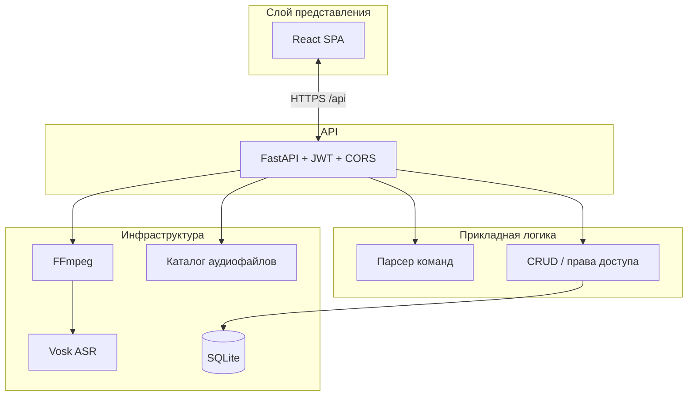

### 4.2. Развёртывание (разработка)

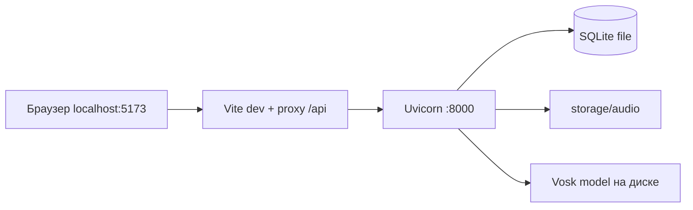

### 4.3. Компоненты бэкенда

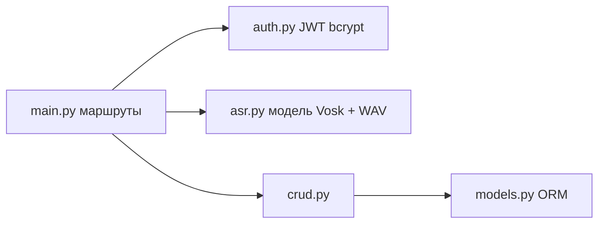

### 4.4. Последовательность: вход в систему

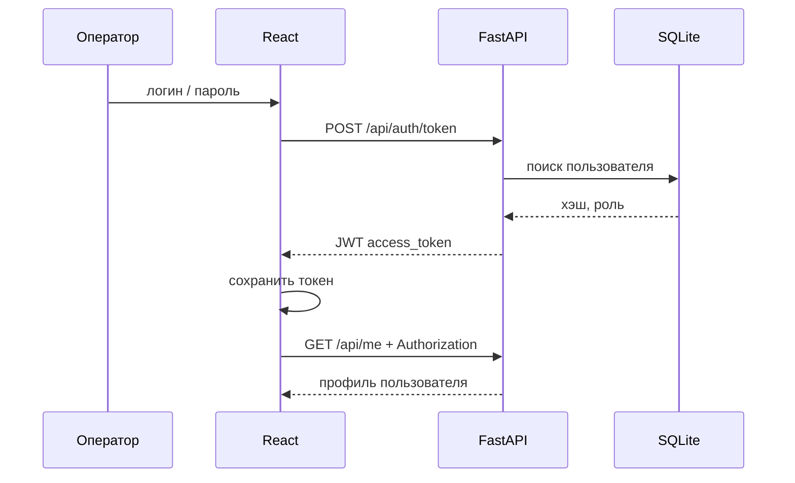

### 4.5. Последовательность: запись и распознавание

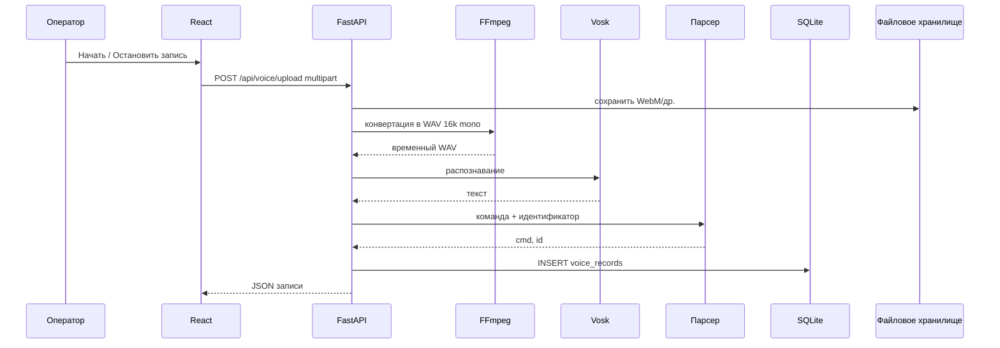

### 4.6. Последовательность: подтверждение в истории

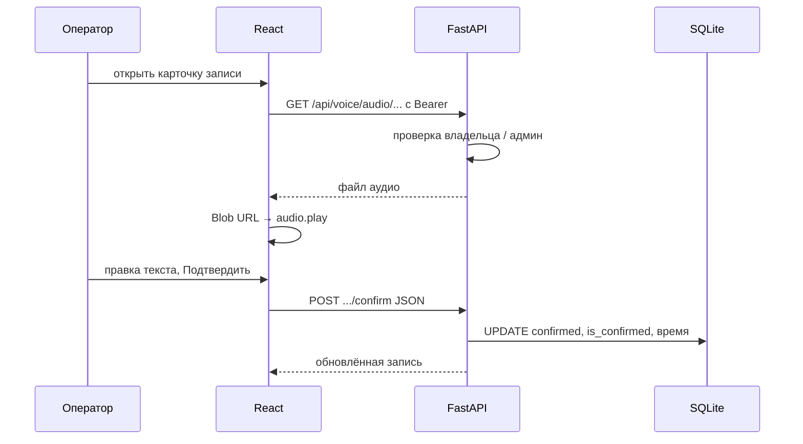

### 4.7. Жизненный цикл записи (состояния)

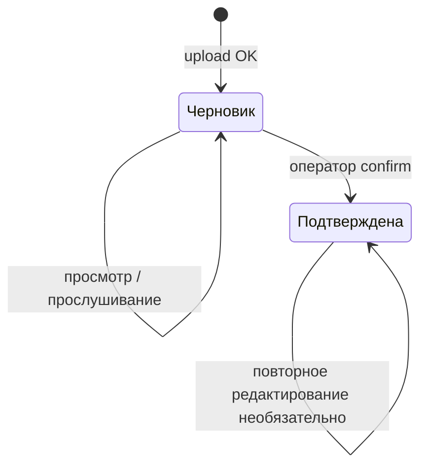

### 4.8. ER-модель (связи и ключи)

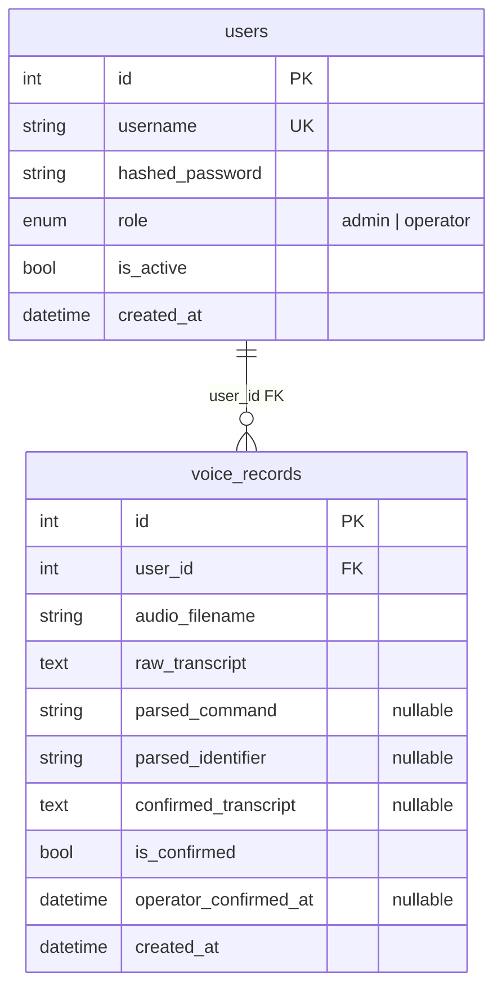

### 4.9. DFD: контекстная диаграмма (уровень 0)

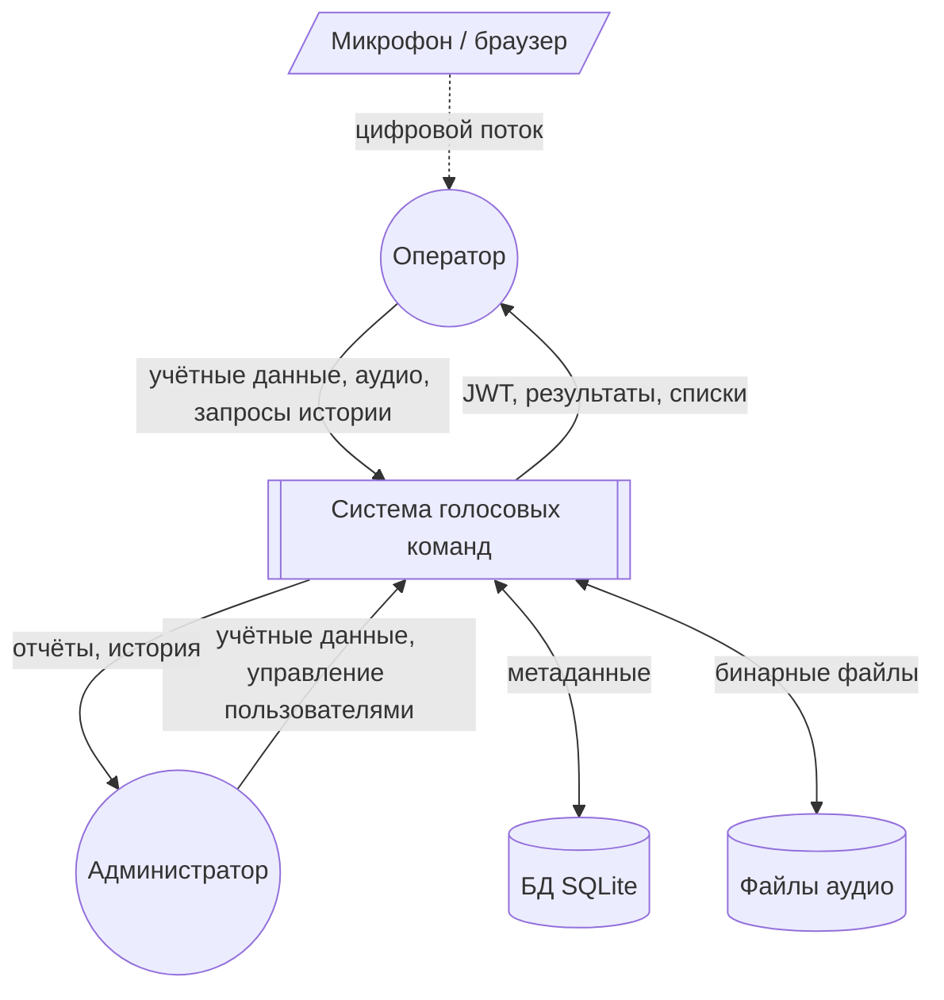

### 4.10. DFD: уровень 1 (процессы и хранилища)

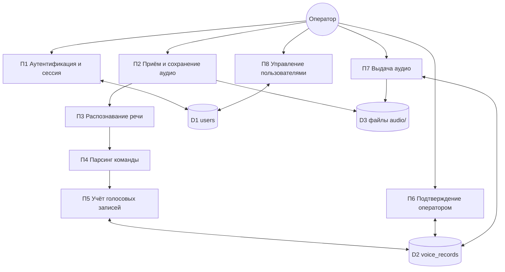

### 4.11. Use Case (связь акторов и прецедентов)

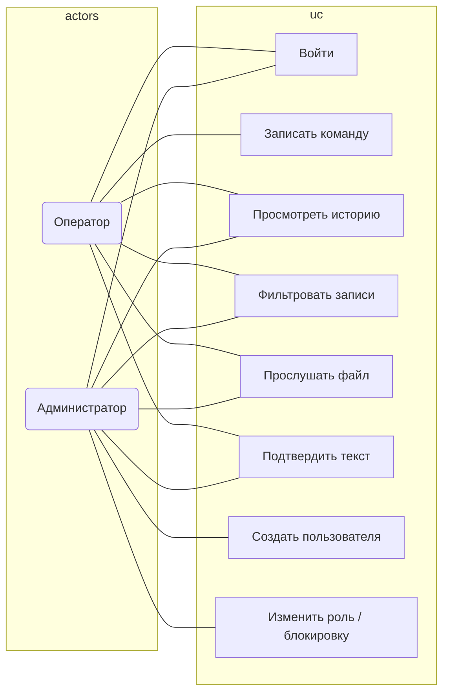

---

## 5. Безопасность и разграничение доступа

| Действие | operator | admin |
|----------|----------|-------|
| Загрузка голоса | да | да |
| Список записей | только свои | все |
| Подтверждение | свои | любые |
| Аудио | свои файлы | любые |
| CRUD пользователей | нет | да |

Пароли хранятся как **bcrypt**-хэш. JWT передаётся в заголовке `Authorization: Bearer ...`.

---

## 6. Ограничения и допущения MVP

- Одна SQLite-файл, без горизонтального масштабирования.
- Список команд фиксирован в коде парсера.
- Качество распознавания зависит от модели Vosk, микрофона и шума; для демо использовалась полная модель **vosk-model-ru-0.42** (см. README).
- Для файлов демо в GitHub используется **Git LFS** из-за лимита размера обычного Git.

---

## 7. Экспорт диаграмм

Диаграммы в формате **Mermaid** можно:

- просматривать на GitHub при открытии этого файла;
- вставить в отчёт через [Mermaid Live Editor](https://mermaid.live) (экспорт PNG/SVG);
- открыть в VS Code / Cursor с расширением для предпросмотра Mermaid.

---

*Документ отражает состояние проекта на момент подготовки к сдаче; при изменении API или схемы БД обновите соответствующие разделы и диаграммы.*
