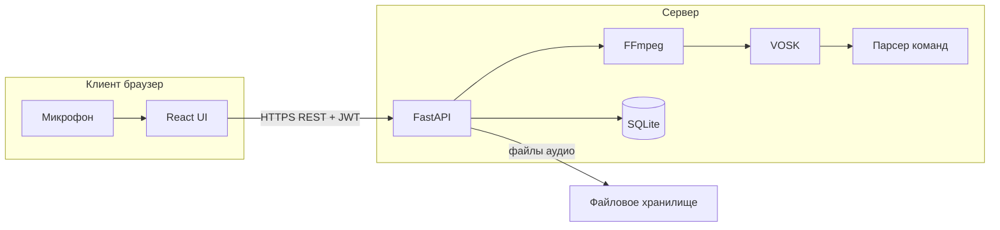
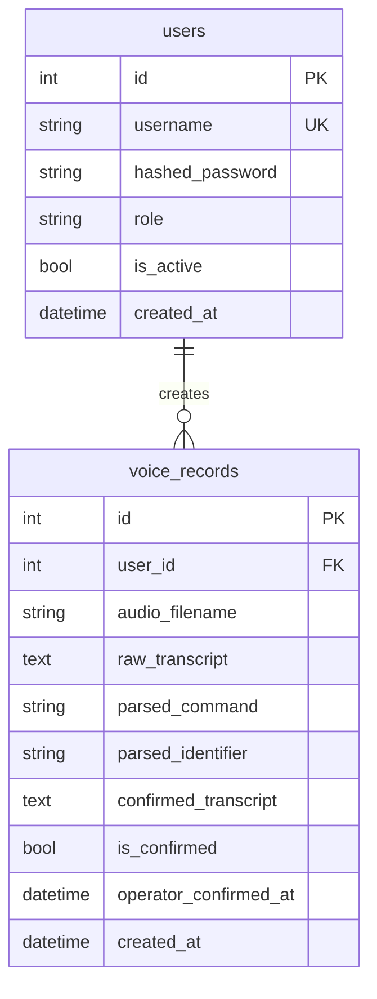
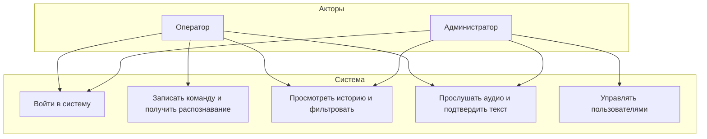
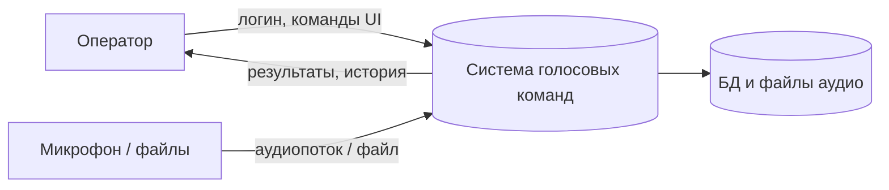
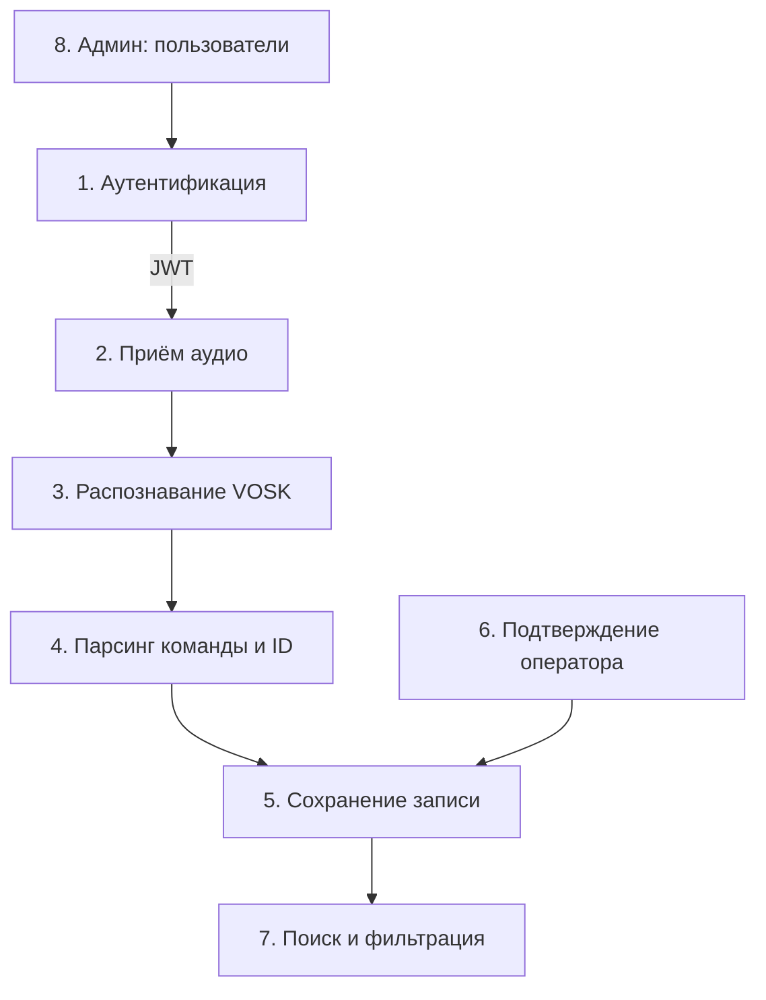

# Описание технического решения (к заданию «Голосовые команды»)

Документ структурирован по критериям оценивания из задания (раздел 2).

**Расширенное описание** всего функционала, структуры репозитория и **полный набор диаграмм** (в т.ч. последовательностей и детализированный DFD) — в файле [FULL_PROJECT_DOCUMENTATION_RU.md](FULL_PROJECT_DOCUMENTATION_RU.md).

---

## 2.1. Схема решения (до 5 баллов)

### Назначение компонентов

| Компонент | Задача |
|-----------|--------|
| **React (Vite)** | Формы входа, запись с микрофона (MediaRecorder → WebM), список записей с фильтрами, карточка с аудио и правкой текста, админ-панель пользователей |
| **FastAPI** | REST API, JWT-аутентификация, загрузка файлов, вызов распознавания, парсинг команды, CRUD по БД, выдача аудио с проверкой прав |
| **VOSK** | Локальное offline-распознавание речи (русская модель) |
| **FFmpeg** | Приведение входного аудио к WAV PCM 16 kHz mono для VOSK |
| **SQLite** | Хранение пользователей, ролей и истории распознаваний |

### Логическая схема

### Использование ИИ (обязательное раскрытие)

**Инструмент:** Cursor (встроенный ассистент на базе LLM) для ускорения разработки.

**Задачи, где применялся ИИ:** ускорение разработки в Cursor — каркас API и UI, интеграция VOSK/FFmpeg, автотесты, отладка по логам (загрузка фронта, пустое распознавание, микрофон в браузере), логирование ASR, настройка Git LFS для демо-видео, правки README.

**Промпты и отчёт об ИИ:** перечень запросов, практики промпт-инжиниринга и блок «что делалось самостоятельно» — **[prompts/PROMPTS_RU.md](prompts/PROMPTS_RU.md)**; личный отчёт от первого лица — **[prompts/OTCHET_ISPOLZOVANIE_II_RU.md](prompts/OTCHET_ISPOLZOVANIE_II_RU.md)** (папка `docs/prompts/`).

**Личный вклад:** постановка требований и сценариев, выбор и настройка моделей Vosk, установка окружения (Python, Node, FFmpeg), ручное тестирование MVP, запись демо-ролика, оформление отчётной документации и репозитория под критерии сдачи.

*Если ИИ не использовался — удалите подраздел «Использование ИИ» и явно укажите в отчёте «генеративные модели не применялись».*

---

## 2.2. Технологии (до 5 баллов)

| Технология | Версия (ориентир) | Назначение |
|------------|-------------------|------------|
| Python | 3.11+ | Язык бэкенда |
| FastAPI | 0.115.x | HTTP API, валидация, OpenAPI |
| SQLAlchemy | 2.0.x | ORM, миграции не обязательны для MVP (`create_all`) |
| python-jose | 3.3.x | JWT |
| passlib + bcrypt | — | Хэш паролей |
| vosk | 0.3.x | ASR |
| SQLite | встроено | БД |
| FFmpeg | системный | Конвертация аудио |
| React | 18.x | UI |
| Vite | 6.x | Сборка и dev-сервер с proxy на API |

Эндпоинты реализованы как **синхронные** (`def`), без `async`/`await` по осознанному выбору: доминирующие операции (Vosk, FFmpeg) блокирующие, SQLite с синхронным ORM достаточен для MVP. Подробнее: [WHY_SYNC_BACKEND_RU.md](WHY_SYNC_BACKEND_RU.md).

---

## 2.3. База данных (до 10 баллов)

### Инфологическое описание

**Сущность «Пользователь»:** учётная запись оператора или администратора; атрибуты — уникальный логин, хэш пароля, роль, признак активности, дата создания.

**Сущность «Голосовая запись»:** один сеанс распознавания; связана с пользователем, который загрузил аудио. Хранит имя файла аудио, сырой текст распознавания, извлечённые команду и идентификатор, подтверждённый оператором текст, флаг и время подтверждения, время создания записи.

### Даталогическая модель (реляционная схема)

### Поля и типы (SQLite)

**`users`**

| Поле | Тип | Ключ / ограничения |
|------|-----|---------------------|
| id | INTEGER | PK, автоинкремент |
| username | VARCHAR(64) | UNIQUE, NOT NULL |
| hashed_password | VARCHAR(255) | NOT NULL |
| role | VARCHAR(16) | NOT NULL, значения `admin` / `operator` |
| is_active | BOOLEAN | NOT NULL, по умолчанию true |
| created_at | DATETIME | NOT NULL |

**`voice_records`**

| Поле | Тип | Ключ / ограничения |
|------|-----|---------------------|
| id | INTEGER | PK |
| user_id | INTEGER | FK → users.id, NOT NULL, индекс |
| audio_filename | VARCHAR(255) | NOT NULL |
| raw_transcript | TEXT | NOT NULL |
| parsed_command | VARCHAR(128) | NULL |
| parsed_identifier | VARCHAR(128) | NULL |
| confirmed_transcript | TEXT | NULL |
| is_confirmed | BOOLEAN | NOT NULL |
| operator_confirmed_at | DATETIME | NULL |
| created_at | DATETIME | NOT NULL, индекс |

Файлы аудио хранятся в файловой системе (`backend/storage/audio/`); в БД — только имя файла.

---

## 2.4. Процессы, сценарии, информационные потоки (до 15 баллов)

### UML Use Case (упрощённо)

### DFD (уровень контекста)

### DFD (уровень 1, основные потоки)

### Соответствие пользовательским сценариям MVP

| Сценарий | Реализация |
|----------|------------|
| 1. Распознать команду | Вкладка «Запись» → MediaRecorder → `POST /api/voice/upload` → отображение текста, команды, параметра |
| 2. Корректировка | «История» → «Карточка» → прослушивание через blob URL → правка → «Подтвердить» → `POST .../confirm` |
| 3. Поиск | Фильтры по тексту команды, параметру, датам, оператору (для админа) |
| 4. Администрирование | Вкладка «Пользователи»: создание, смена роли, блокировка |

---

## Парсер команд (логика извлечения)

Из текста в нижнем регистре ищется одна из фиксированных подстрок-команд. Идентификатор: приоритет у последовательности из **8 и более цифр** (в т.ч. без пробелов); иначе — **токен из букв/цифр длиной ≥ 4** (латиница и кириллица), с отсечением коротких чисто цифровых токенов короче 8 символов; запасной вариант — 6–7 цифр подряд.

---

*При сдаче приложите ссылку на публичный репозиторий или архив исходников, а также инструкцию по развёртыванию из `README.md`.*
